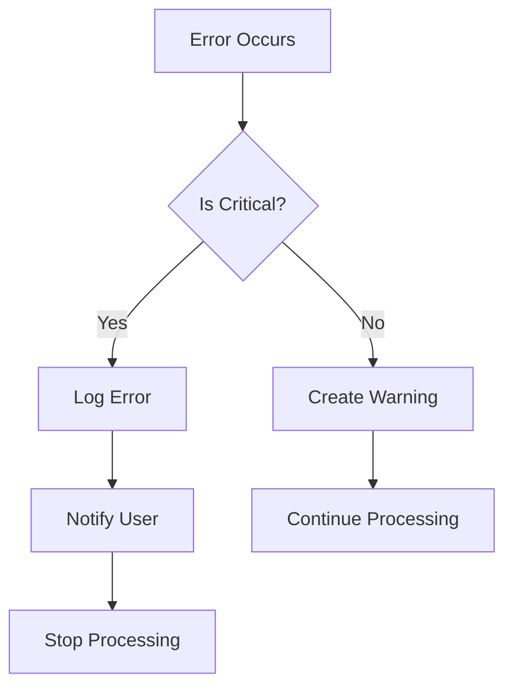

# TabComp Architecture Overview

## Module Structure

TabComp is organized into the following modules:

1. [File Handler](modules/file_handler.md)

   - File validation and parsing
   - Encoding detection
   - Sheet management

2. [Data Processor](modules/data_processor.md)

   - Data normalization
   - Field matching
   - Comparison engine

3. [Output Generator](modules/output_generator.md)

   - Report generation
   - Formatting
   - Logging

4. [User Interface](modules/user_interface.md)

   - GUI components
   - User interaction handling

5. [Configuration Manager](modules/config_manager.md)
   - Settings management
   - Runtime configuration

## API Contracts

### Interface Definitions

Each module exposes a well-defined API interface:

```python
@dataclass
class ValidationResult:
    is_valid: bool
    errors: List[ErrorResponse]
    warnings: List[str]

@dataclass
class ParsedData:
    data: pd.DataFrame
    metadata: Dict[str, Any]
    encoding: str
    sheet_name: str

@dataclass
class ComparisonResult:
    differences: pd.DataFrame
    summary: Dict[str, Any]
    execution_time: float
    memory_usage: int

@dataclass
class FieldMapping:
    matched_fields: Dict[str, str]
    unmatched_fields: List[str]
    primary_keys: List[str]
```

### API Versioning

```python
class APIVersion:
    MAJOR = 1
    MINOR = 0
    PATCH = 0

    @classmethod
    def get_version(cls) -> str:
        return f"v{cls.MAJOR}.{cls.MINOR}.{cls.PATCH}"
```

### Module Communication

```python
# Example of inter-module communication
class FileHandlerAPI:
    @api_version("1.0.0")
    async def process_file(
        self,
        file_path: str,
        config: Config
    ) -> Result[ParsedData, ErrorResponse]:
        try:
            validation = await self.validate_file(file_path)
            if not validation.is_valid:
                return Err(validation.errors[0])

            data = await self.parse_file(file_path)
            return Ok(data)
        except Exception as e:
            return Err(self._handle_error(e))
```

## Error Handling Standards

### Error Response Format

```python
@dataclass
class ErrorResponse:
    code: str                # Unique error identifier
    message: str             # User-friendly message
    details: Dict[str, Any]  # Technical details
    timestamp: datetime      # Error occurrence time
    severity: ErrorSeverity  # ERROR, WARNING, INFO
    context: Dict[str, Any]  # Operation context
    suggested_action: str    # Recommended fix
```

### Error Categories

1. Validation Errors (1xxx)

   ```python
   FILE_TOO_LARGE = "1001"
   INVALID_FORMAT = "1002"
   ENCODING_ERROR = "1003"
   ```

2. Processing Errors (2xxx)

   ```python
   PARSE_ERROR = "2001"
   COMPARISON_ERROR = "2002"
   MEMORY_ERROR = "2003"
   ```

3. Output Errors (3xxx)
   ```python
   WRITE_ERROR = "3001"
   FORMAT_ERROR = "3002"
   PERMISSION_ERROR = "3003"
   ```

### Error Handling Flow



## Testing Requirements

### Test Categories

1. Unit Tests

   ```python
   @pytest.mark.unit
   class TestFileHandler:
       def test_file_validation(self):
           # Test specific functionality
           pass
   ```

2. Integration Tests

   ```python
   @pytest.mark.integration
   class TestModuleIntegration:
       def test_end_to_end_flow(self):
           # Test module interaction
           pass
   ```

3. Performance Tests
   ```python
   @pytest.mark.performance
   class TestPerformance:
       def test_large_file_processing(self):
           # Test performance metrics
           pass
   ```

### Test Coverage Requirements

- Line Coverage: ≥ 90%
- Branch Coverage: ≥ 85%
- Function Coverage: 100%

### Performance Benchmarks

1. File Processing

   ```python
   def test_file_processing_speed():
       # Test file loading speed
       assert load_time < 3.0  # seconds for 100MB
       # Test memory usage
       assert max_memory < file_size * 2
   ```

2. Comparison Operations

   ```python
   def test_comparison_performance():
       # Test comparison speed
       assert rows_per_second > 100_000
       # Test memory efficiency
       assert peak_memory < initial_memory * 2
   ```

3. UI Responsiveness
   ```python
   def test_ui_responsiveness():
       # Test UI interaction latency
       assert response_time < 0.1  # seconds
   ```

### Automated Testing Pipeline

```yaml
name: Test Suite
on: [push, pull_request]

jobs:
  test:
    runs-on: ubuntu-latest
    steps:
      - uses: actions/checkout@v2
      - name: Run Tests
        run: |
          pytest tests/ --cov=tabcomp
          pytest tests/performance/
```

## Memory Management

### Memory Monitoring

```python
class MemoryTracker:
    def __init__(self):
        self.peak_usage = 0
        self.start_time = time.time()

    def track(self):
        current = psutil.Process().memory_info().rss
        self.peak_usage = max(self.peak_usage, current)
```

### Resource Cleanup

```python
class ResourceManager:
    def __init__(self):
        self.resources = []

    async def cleanup(self):
        for resource in self.resources:
            await resource.close()
```

## Performance Optimization

1. Chunked Processing

   ```python
   async def process_large_file(file_path: str, chunk_size: int):
       for chunk in pd.read_csv(file_path, chunksize=chunk_size):
           await process_chunk(chunk)
   ```

2. Caching Strategy

   ```python
   @lru_cache(maxsize=1000)
   def compute_field_hash(field_content: str) -> str:
       return hashlib.md5(field_content.encode()).hexdigest()
   ```

3. Parallel Processing
   ```python
   async def compare_tables(table1, table2):
       tasks = [
           compare_chunk(chunk1, chunk2)
           for chunk1, chunk2 in zip(table1.chunks, table2.chunks)
       ]
       results = await asyncio.gather(*tasks)
   ```
